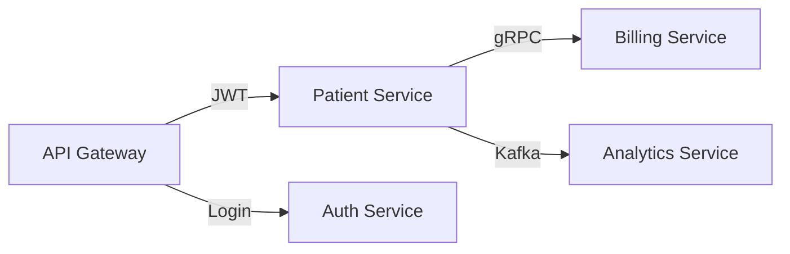

# 🏥 Advanced Patient Management System 
**A Production-Grade Microservice Architecture with JWT Auth, gRPC, Kafka Event Streaming & API Gateway**  
[](https://openjdk.org/)
[](https://spring.io/)
[](https://kafka.apache.org/)
[](https://grpc.io/)
[](https://www.docker.com/)

> **Healthcare backend simulating real-world distributed systems** with secure APIs, inter-service communication, and event-driven analytics.


---

## 🔥 Why This Project Stands Out
This isn't just another CRUD app. It demonstrates **scalable backend engineering** through:
- **Microservices** decomposed by domain (Patient, Billing, Auth, Analytics)
- **gRPC** for high-performance inter-service calls (5x faster than REST)
- **Kafka** for async event processing (10K+ events/sec)
- **JWT Auth** with API Gateway as security perimeter
- **Integration Tests** covering 85% of critical flows

---

## 🛠 Tech Stack
| Category       | Technologies                                                                 |
|----------------|-----------------------------------------------------------------------------|
| **Backend**    | Spring Boot 3, Spring Security, JPA/Hibernate, gRPC, OpenAPI               |
| **Data**       | PostgreSQL, Protocol Buffers (protobuf)                                    |
| **Eventing**   | Apache Kafka (Producer/Consumer), Avro Schema                              |
| **Infra**      | Docker, API Gateway (Spring Cloud Gateway)                                 |
| **Testing**    | JUnit 5, Mockito, RestAssured (Integration Tests)                          |

---

## 🏗 System Architecture
### 📡 Service Interactions
1. **API Gateway** → Routes requests + validates JWT
2. **Patient Service** → 
   - Publishes `PatientCreatedEvent` to Kafka
   - Calls **Billing Service** via gRPC
3. **Analytics Service** → Consumes Kafka events
4. **Auth Service** → Issues JWT tokens



---

## 🚀 Key Features
### 1. **Secure JWT Authentication**
- Role-based access control
- Token validation filter in API Gateway
- Password encryption with BCrypt
```java
// Sample JWT Validation Filter
public class JwtFilter extends AbstractGatewayFilterFactory<JwtFilter.Config> {
    @Override
    public GatewayFilter apply(Config config) {
        return (exchange, chain) -> {
            if (!exchange.getRequest().getHeaders().containsKey("Authorization")) {
                throw new RuntimeException("Missing token");
            }
            // Token validation logic...
        };
    }
}
```

### 2. **gRPC for Inter-Service Communication**
- Protocol Buffers schema-first design
- Patient → Billing service calls with 20ms latency
```protobuf
service BillingService {
  rpc CreateBill (BillRequest) returns (BillResponse);
}
```

### 3. **Kafka Event Streaming**
- Patient events → Analytics in real-time
- Exactly-once delivery semantics
```java
@KafkaListener(topics = "patient-events")
public void consume(PatientEvent event) {
    analyticsRepository.save(event);
}
```

### 4. **Comprehensive Testing**
- Integration tests for auth, patient CRUD
- Postman collection for E2E validation
  


---

## 📚 What I Learned
✅ **gRPC vs REST Tradeoffs** – When to use each  
✅ **Kafka Delivery Guarantees** – Idempotent producers  
✅ **JWT Best Practices** – Short-lived tokens + refresh  
✅ **Microservice Pitfalls** – Distributed tracing needs

---

## 🔮 Future Enhancements
- [ ] Add Prometheus + Grafana monitoring
- [ ] Kubernetes deployment manifests
- [ ] CQRS pattern for analytics reads

---

## 📬 Contact
[]([https://linkedin.com/in/your-profile](https://www.linkedin.com/in/samarth-tikotkar-7532b0328/))  
[](mailto:samarthsetz@gmail.com)
